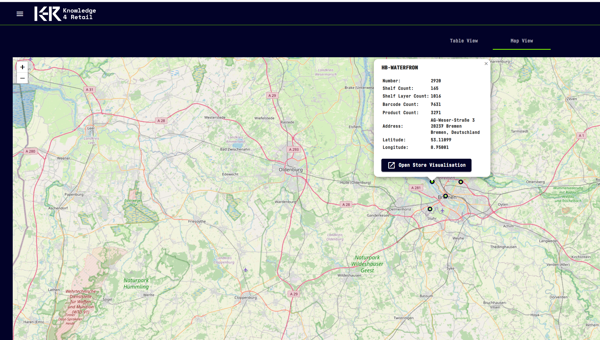

# K4R Portal application
## Overview
The portal application provides an overview of installed k4r services, a map-based view on your digital twins as well as a dynamic digital twin data model visualization. It is a web application based on angular in the browser (repository k4r-portal) and springboot+kotlin in the backend (repository k4r-portal-backend).
## Features
### Dashboard
The dashboard shows all installed k4r services, their version number and more meta information. To add your own tiles, deploy kubernetes custom resources of type k4r-interface. Please refer to the [infrastructure repository]( https://github.com/knowledge4retail/k4r-infrastructure/blob/main/basic-infrastructure/k4r-crd/templates/k4r-interface-definition.yaml) for examples.

### Digital Twins
Open the burger menu and select stores for an overview of your digital twins and their objects. Table and map-based views are available.

### DT Schema
Everytime a new digital twin (dt-api) version gets deployed, the schema docs are updates. The menu item DT Schema opens a detailed report about the current state.

